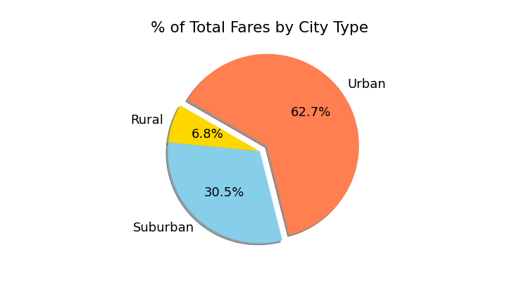
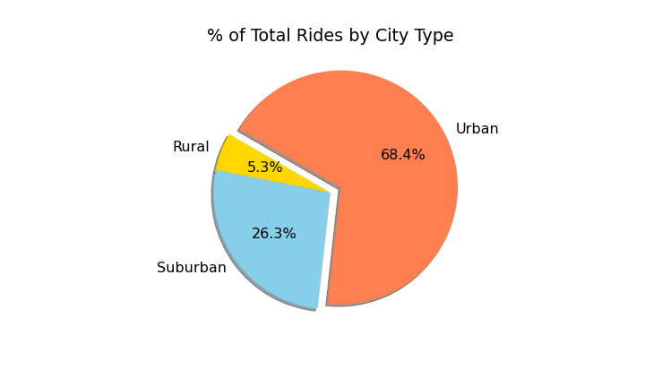
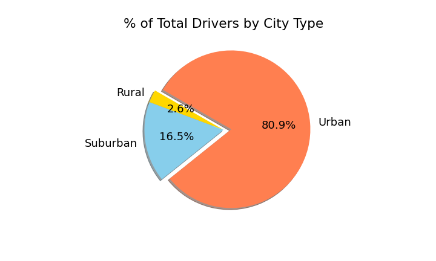
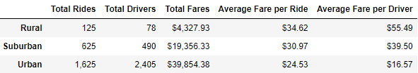
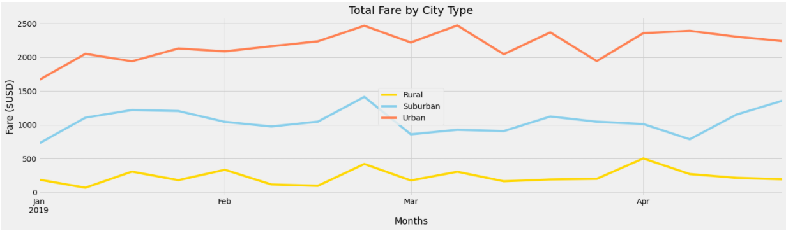

# PyBer-Analysis

## Project Overview
PyBer, a ride sharing company, has tasked me with performing some exploratory analysis to create a variety of different visualizations to showcase the relationship between a variety of different variables:

1. The type of city:
	- Rural
	- Suburban
	- Urban
2. The total number and percentages of drivers
3. The total number and percentages of riders.
4. The total amount and percentage of fares

By showing PyBer the connections and insights related to these variables, they will be able to more confidently know how to improve access to their ride sharing services and be more accurately determine affordable pricing for their service.

## Resources
- Data: 
	- resources/city_data.csv
	- resources/ride_data.csv
- Software: 
	- Python 3.7.10
	- Jupyter Notebook
	- Pandas Library
	- Matplotlib Library
	- NumPy Library

## Results
  

Looking at the data, we can obviously see that PyBer is most active in urban cities, then in suburban cities, and lastly, rural cities. urban cities have the high amount of drivers and riders, as well as generating the largest amount of revenue. Although the total percent of rides and total fares seems to be consistent (~60-70%), urban cities have a large disproportionate amount of drivers (86.7%).

 

Although urban cities dominate in the total amount of rides, drivers, and fares, that is not the case when looking at the average fare per ride or driver. In these cases, rural and suburban cities have a much higher average fare per ride, and a significantly higher average fare per driver compared to their urban counterpart. This may be due to the fact that rural and suburban cities have more total rides than total drivers, whereas urban cities have many more drivers than the total amount of rides.

 

Looking at this line plot, its undeniable that urban cities generate the most revenue, followed by suburban and rural cities respectively, regardless of the time of the year. Leading into the month of March, there seems to be a noticeable peak in all of the different city types. More analysis would be needed to understand its significance however.

## Summary
Ultimately, PyBer is most active in urban areas, having the highest amount of drivers, rides, and fares generated. Therefore PyBer should focus the majority of its advertising and marketing in those areas. However, there is a significantly higher amount of drivers per ride in urban cities, so focusing on trying to increase that total amount of rides in urban cities, as well as trying to up the total amount of drivers in both rural and suburban areas would be advantageous. Rural cities have a much higher average fare per ride and driver, which could potentially be attributed to both higher average travel distances, as well as a shortage of total drivers. In the future, there could be more analysis done to see the correlation between average travel distance and the other contributing factors.